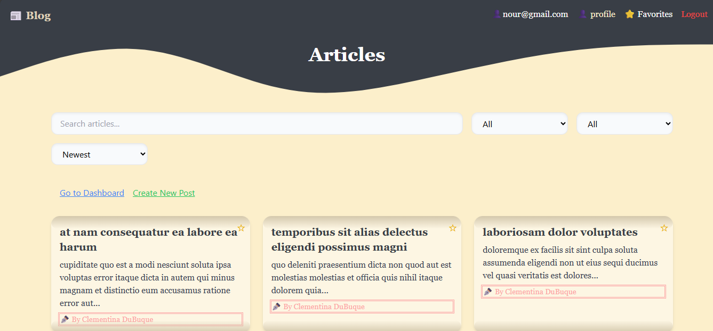
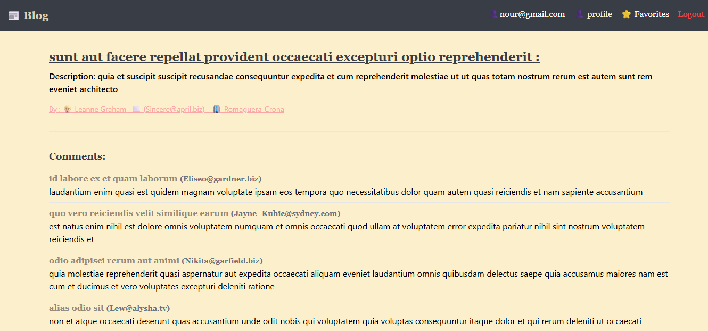
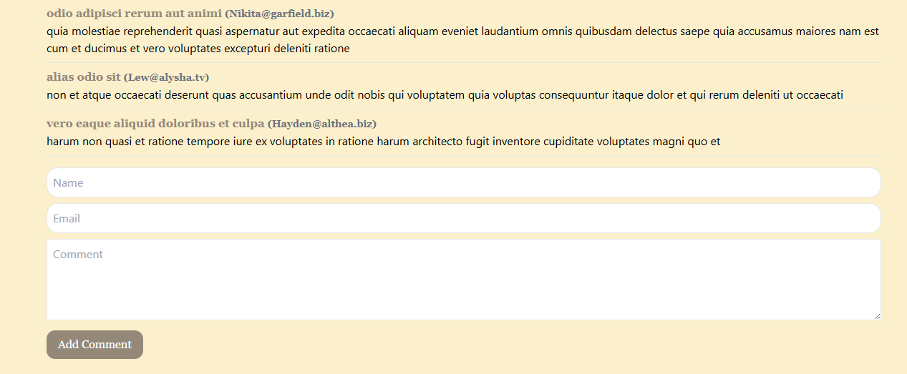
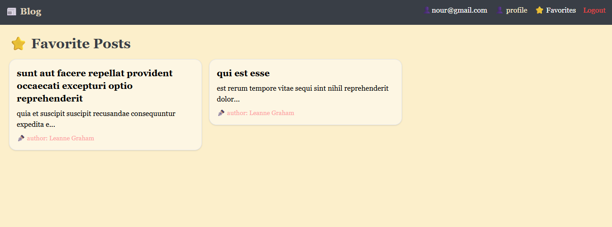
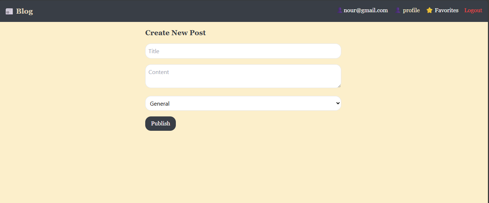
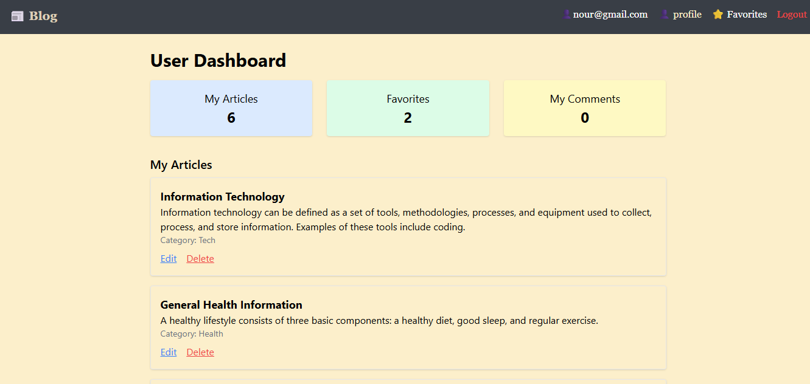
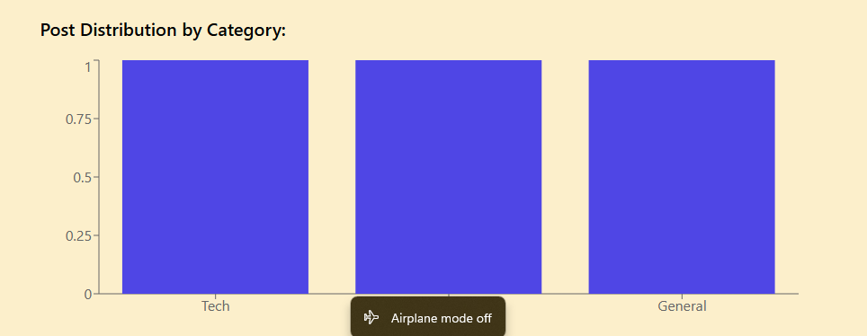
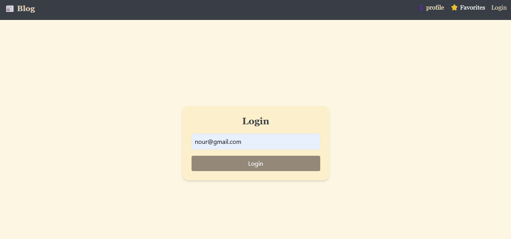
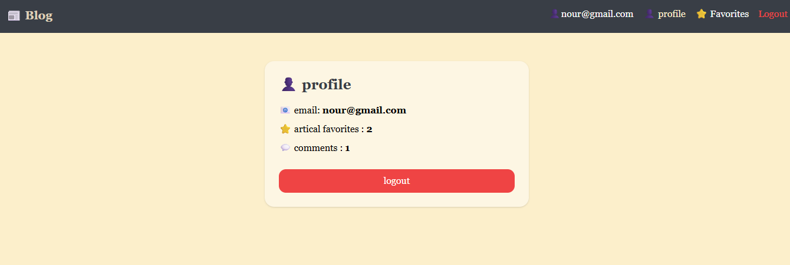

# 📝 Blog App – React + Zustand + Tailwind

Welcome to Blog App – a simple and powerful blogging app built with React.
This project aims to simulate a real blogging system where users can:

- Read various articles,

- Create their own articles,

- Add comments,

- Manage favorites,

- View a dashboard displaying interactive statistics.

This project is a powerful learning experience for applying modern React concepts such as:

- State management using Zustand

- Navigating via React Router

- Local Storage

- Fetching data from a mock API (JSONPlaceholder)

---

## Screenshots:

### home


### Detalis



### Favorites

 
### Create Post


### Dashboard


### Statistical Chart


### Login


## Profile


----------------------------------------------------------

## 🚀 Operating steps

1. **Download the project:**

```bash
git clone <Repository Link >
cd blog-app
```

2. **Installing packages:**

```bash
npm install
```

3. **Run the application:**

```bash
npm run dev
```

Open your browser and go to:  
[http://localhost:5173](http://localhost:5173)

---------------------------------------------------------------------

## 🔐 Login mechanism:

- To log in, go to the **Login** page from the navigation bar or directly via the link:
👉 `/login`

- Enter your **email address** (no password required).
- Your email address will be stored in `localStorage` for local login.
- After logging in, you can:
- Add comments.
- Add or remove favorites.
- Access your "Favorites" and "Profile" pages.

---------------------------------------------------------------------------------------

## 🔗 Page links:

| Page | Link | Description |
|---|-------------------|-------|
| 🏠 Home | `/` | View all articles |
| ⭐ Favorites | `/favorites` | View articles you have added to your favorites |
| 👤 Profile | `/profile` | View registered user data |
| 🔐 Login | `/login` | Email login page |
| 📄 Article details | `/posts/:id` | View details and comments for each article |

----------------------------------------------------------------------------------------

## 💡 Notes

- Comments and likes are local (not linked to a real database).
- Favorites are stored using `localStorage`.
- Login status is managed using Zustand.